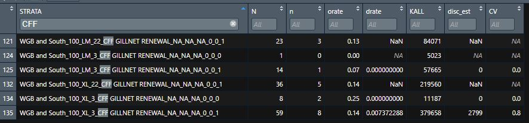
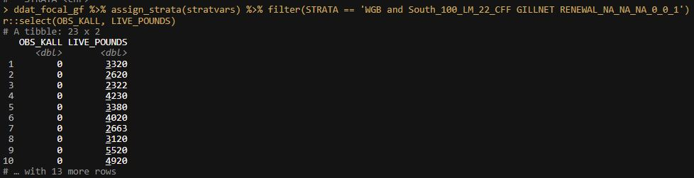

### January 25, 2022

**APSD.CAMS\_DISCARD\_EXAMPLE\_GF19**

#### OCEAN POUT example

This example includes all trips for Fishing Year 2019 (May 2019 start). Stratification for groundfish trips was

-   Stock Area
-   Gear (`CAMS_GEAR_GROUP`)
-   Mesh (`MESHGROUP`)
-   Sector
-   Exemption (there are four possible exemptions)

An assumed rate was used for non-groundfish trips

-   Stock Area
-   Gear (`CAMS_GEAR_GROUP`)

### Issues

according to 2020 ACL accounting, this should include

-   Mesh ('MESHGROUP') ADDED

Sector and Exemptions are carrying through to non-groundfish trips. This is affecting which rate is being used. (see below, need to split these out)

-   Non-groundfish trips should not include these stratifications.

-   Estimates of yellowtail and windowpane from scallop trips need to come from scallop specific stratification.

### Snoops..

Difference in stratification

```sql
-- number of gear groups for Ocean Pout
select distinct(CAMS_GEAR_GROUP)
from APSD.CAMS_GEARCODE_STRATA
where NESPP3 = 250
```

| CAMS\_GEAR\_GROUP | Gear Type               |
|:------------------|:------------------------|
| 0                 | other                   |
| 100               | Gillnet                 |
| 132               | scallop dredge          |
| 50                | Trawls                  |
| 54                | Ruhle Trawl             |
| 57                | Haddock Separator Trawl |

Dan Caless's summary has nine gear groupings:

Gillnet Longline and other line gear Otter trawl Pot, lobster Pair trawl Purse seine Pot and traps Twin trawl Other

#### Scallop Trips:

Dan C. does this separately. Stratifies GF discard rates by - Gear (Trawl/Dredge) - Fleet (LA/LAGC) - does NOT stratify by Access Area/Open; only by stock area - Yellowtail and Windowpane stocks are derived from scallop in season QM procedure

In summary, QM groundfish gets year-end estiamtes in three steps: - GF Trips (`Sector/Gear/Mesh/Exemption`) - Scallop trips (`Gear/Fleet`) - YTF and WP on scallop trips done in scallop procedure(module) (`Gear/Fleet/AA vs Open`) - All other Trips (`Gear group/Mesh`)

```sql
-- look at CV by strata
select distinct(STRATA_ASSUMED)
, STRATA
, DISC_RATE
, ARATE
, CRATE
, CV
, n_obs_trips
, a.CAMS_GEAR_GROUP
, MESHGROUP
, SPECIES_ITIS_EVAL
from APSD.CAMS_DISCARD_EXAMPLE_GF19 a
where activity_code_1 not like 'NMS%'
order by a.CAMS_GEAR_GROUP, MESHGROUP
```

from Dan Caless: `DISC_RATE_TYPE of 'I' stands for in-season rate, wholly based on at least five in-season observed trips. Type = 'T' is Transition, based partially on the assumed rate and partially based on between one and four in-season trips, and 'A' are assumed rates based primarily on last year's discard rates.`

*Q: Is (A) specific to strata or does it default to broad stock rate?*

from dan C.: 1. They equal last FY in-season if they exist 2. else they group across sectors, but keep the other strata 3. else they group across all strata by stock

`I keep them if they have five or more trips`

Dan splits groundfish and non-groundfish trips and stratifies separately.

Example:

```sql
-- pull one strata for ocean POUT

with pout as (
   select SPPCODE
  , SECGEARFISH
  , MESH_CAT
  , SECTOR_ID
  , OTHER_STRATA, DISCARD_RATE
  , DISC_RATE_TYPE
  from fso.T_OBSERVER_DISCARD_RATE
  where fishing_year = 2019
  and nespp3 = 250
  and STOCK_ID = 'OPTGMMA'
  and SECTOR_ID = 10
  and MESH_CAT = 'ELM'
)

select distinct(SECGEARFISH)
  , MESH_CAT
  , OTHER_STRATA
  , DISCARD_RATE
  , DISC_RATE_TYPE
  from pout
  order by SECGEARFISH, MESH_CAT
```

-   `discaRd` shows 77 trips observed for strata `Sector 10, XL mesh, Gillnet`

Caless has this sector using an assumed rate, meaning there would not be many (or any) obs trips

*There was a problem with SECTOR\_ID in MAPS matchign tables. This has been fixed*

## Feb 1, 2022

-   Multiple LINK1 on a single VTR are sneaking through our fix using only observed hauls. THe species foudn on these trips, for the entire 2018-2020 dataset in groundfish tips are : \] "660" "667" "679" "680" "681" "682" "683" "685" "687" "689" NA which correspond to debris unknown fish groups, random invertebrates etc. see following:

```sql 
select *
from obdbs.obspec@NOVA
where substr(NESPP4,1,3) in (660
  , 667
  , 679
  , 680
  , 681
  , 682
  , 683
  , 685
  , 687
  , 689)
```

There are no `SPECIES ITIS` codes for these `NESPP3` codes and are most likely not ever estimated.

Solution may be to filter these rows from the master table (`CAMS_OBS_CATCH`) upon import to `R`. Filtering these will not affect `KEPT ALL` since these are all from trips that (erroneously) have multiple `LINK1` per `VTR`.

## Feb 2, 2022

-   found that there are Strata where all trips report 0 `OBS_KALL` and 0 OBS\_DISCARD.. This creates NaN in `DISC_EST`, `DRATE` and NA in `CV`





**Options** 1. alter the R functions in the `discaRd` package

``` r
get.cochran.ss.by.strat
cochran.calc.ss
```

1.  Use trip KALL for d/k calculation
2.  Ignore these trips. This depends on whether the discard species info can be trusted given the `OBS_KALL` is incorrect.

-   May need to change the trip reference in the R functions above. Now, it is `DOCID`. May need to make this generic and use `VTRSERNO`.. This could affect the CV as using DOCID makes the `N` term smaller than if using `VTRSERNO`

-   Identified that base table `CAMS_OBS_CATCH` may have been built incorrectly. Never completed the multi-layered join in the case with multiple subtrips per LINK1.

-   There may be an issue with the MAPS.MATCH\_OBS table. Observed trips for the strata referenced above do can't be found in the OBS data. The LINK1 doe not match and the VTRSERNO do not match anything in MAPS.MATCH\_OBS

-   found that `TRIPEXT in (C, X)` filtered out records with `L`, which accounts for the mismatch in the above strata.

``` sql
-- example shows that there are hailwts on obs hauls
select *
FROM obdbs.obtrp@nova a
left join (select * from obdbs.obhau@nova) b
on a.LINK1 = b.LINK1
left join (select * from obdbs.obspp@nova) s
on b.LINK3 = s.LINK3
where a.link1 = '000201910R33047'
```

revisit against this table:

``` sql
select *
from obdbs.obtripext@nova
```

## Feb 3, 2022

- TRIPEXT should be only C and X.. DMIS discards are calculated from a table provided by the observer program; and they only use these trip designations.
- Examined Dan Calles's discard script `Discard_Calculations_21_Mults.sql` this is 1500 lines of nested tables and exceptions..
- should re-evaluate whether a new groundfish module is necessary or whether porting the SQL to CAMS is a better option.
- the final discard rate table is not a bad template for an output table.

## Feb 4, 2022

- Removing TRIP_EXT != C or X removes 30,000 of ~80,000 link1 for the entire OBS matching table.

- This should be done in the `MERGE_CAMS_OBS.sql` stage

#### Comparison of results for Haddock 2019

- discard rates for EGB Haddock were ~ 4x lower using CAMS approach than DMIS approach.

- There were ~12 strata in DMIS that did not show up in CAMS as being in season (>=5 trips in the strata). These all fell into the `Trawl LM` category.

- After controlling other aspects, this is likely due to the `CAMS_GEAR_GROUP` and `MESHGROUP` used in CAMS.

- There is a possibility that CAMS trips are not matching to OBS trips on multi-VTR trips due to one element (e.g. AREA) not matching. This is less likely however than the previous point.  

```sql
select distinct(discard_rate)
--,disc_rate_type
, sector_id
, secgearfish
, mesh_cat
from fso.t_observer_discard_rate_priv
where fishing_year = 2019
and STOCK_ID = 'HADGBE'
and disc_rate_type = 'I'

```


| DISCARD_RATE | SECTOR_ID | SECGEARFISH | MESH_CAT |
|--------------|-----------|-------------|----------|
| 0.019379591  | 16        | OTB         | LM       |
| 0.019379591  | 16        | OTF         | LM       |
| 0.036318597  | 22        | OTF         | LM       |
| 0.019379591  | 16        | OTC         | LM       |
| 0.076209491  | 22        | OTB         | LM       |
| 0.076209491  | 22        | OTF         | LM       |
| 0.019379591  | 16        | OTH         | LM       |
| 0.036318597  | 22        | OTC         | LM       |
| 0.076209491  | 22        | OTC         | LM       |
| 0.036318597  | 22        | OTH         | LM       |
| 0.036318597  | 22        | OTB         | LM       |
| 0.076209491  | 22        | OTH         | LM       |

Table of DMIS discards for HADGBE 2019 strata not in CAMS

```SQL
select distinct(discard_rate)
,disc_rate_type
from fso.t_observer_discard_rate_priv
where fishing_year = 2019
and STOCK_ID = 'HADGBE'
and disc_rate_type <> 'I'

```

| DISCARD_RATE | DISC_RATE_TYPE |
|--------------|----------------|
| 0.046521148  | A              |
| 0            | A              |
| 0.057787552  | A              |
| 0.034521631  | A              |
| 0.035437883  | T              |
| 0.021208026  | T              |
| 0.032564803  | T              |
| 0.044642809  | T              |
| 0.040299341  | T              |
| 0.033404436  | T              |
| 0.024165142  | T              |

unique rates, either Assumed (A) or Transition (T) from DMIS. Different combinations of gear and mesh may share rates; this is all unique values.

|SECTOR_TYPE |DISCARD_SOURCE |CAMS_GEAR_GROUP |MESHGROUP |     drate|
|:-----------|:--------------|:---------------|:---------|---------:|
|COMMON_POOL |A              |50              |LM        | 0.0000000|
|COMMON_POOL |B              |0               |na        | 0.0003783|
|COMMON_POOL |B              |10              |na        | 0.0005245|
|COMMON_POOL |B              |100             |LM        | 0.0027069|
|COMMON_POOL |B              |100             |XL        | 0.0000105|
|COMMON_POOL |B              |50              |LM        | 0.0006650|
|COMMON_POOL |B              |50              |SM        | 0.0000000|
|SECTOR      |A              |100             |LM        | 0.0006698|
|SECTOR      |A              |100             |XL        | 0.0000776|
|SECTOR      |A              |50              |LM        | 0.0066887|
|SECTOR      |A              |57              |LM        | 0.0301717|
|SECTOR      |AT             |0               |na        | 0.0005245|
|SECTOR      |AT             |10              |na        | 0.0203849|
|SECTOR      |B              |0               |na        | 0.0005402|
|SECTOR      |B              |10              |na        | 0.0004913|
|SECTOR      |B              |100             |LM        | 0.0032755|
|SECTOR      |B              |100             |XL        | 0.0006957|
|SECTOR      |B              |132             |na        | 0.0005245|
|SECTOR      |B              |57              |LM        | 0.0301705|

CAMS Assumed (A, AT) and Broad Stock (B) discard rates for EGB Haddock 2019. Generally, these are much lower than the Assumed rates in DMIS.

```r
# Get totals by Stock for Haddock 2019

joined_table = joined_table %>%
	mutate(DISCARD = case_when(!is.na(LINK1) ~ DISC_MORT_RATIO*OBS_DISCARD
														 , is.na(LINK1) ~ DISC_MORT_RATIO*COAL_RATE*LIVE_POUNDS)
				 )

joined_table %>%
	group_by(SPECIES_ESTIMATION_REGION, DISCARD_SOURCE) %>%
	dplyr::summarise(DISCARD_EST = sum(DISCARD)) %>%
	pivot_wider(names_from = 'SPECIES_ESTIMATION_REGION', values_from = 'DISCARD_EST') %>%
	dplyr::select(-1) %>%
	colSums(na.rm = T)

```

|         SPECIES_ESTIMATION_REGION     |        Discard|
|:-------------|---------:|
|EGB           |  25,841|
|GOM           | 150,784|
|MA            |      0.00|
|WGB and South | 309,689|

CAMS discard estimate for Haddock 2019  


| STOCK  | SPECIES | DISCARD ESTIMATE |
|--------|---------|------------------|
| HADGBE | HADDOCK |         107,176  |
| HADGBW | HADDOCK |         384,367  |
| HADGM  | HADDOCK |         202,985  |

DMIS estimate for Haddock 2019 

- EGB shows the highest % difference (~75%) while the others show ~25% difference.
-
