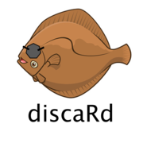

## an R package for calculating discard sing the Cochran ratio estimator

This package was originally developed as part of the GARFO discard peer review in 2016. More information on the review may be found here: <https://www.fisheries.noaa.gov/new-england-mid-atlantic/science-data/discard-methodology>

The package has been substantially updated and re-purposed to carry out discard estimation for all managed species in the Greater Atlantic Region. These estimates are done on a weekly basis as part of the Catch Accounting and Monitoring System ([CAMS](https://apps-garfo.fisheries.noaa.gov/cams/)). Discard estimates are the official estimates for all users in the Region.

## Installation

`remotes` is the small part of `devtools` for loading remote data so either work

```{r}
library(remotes)
install_github("noaa-garfo/discaRd", auth_token = "use your auth token")
```

## Use

<!-- To see an example vignette: -->

<!-- ``` -->

<!-- library(discaRd) -->

<!-- vignette("eflalo_demo") -->

<!-- ``` -->

<!-- One of the main functions is `get.cochran.ss.by.strat()`. To see the instructions for this run `?get.cochran.ss.by.strat` in R. (NO HELP FILE FOR THIS CURRENTLY - ADDING GITHUB ISSUE) -->
